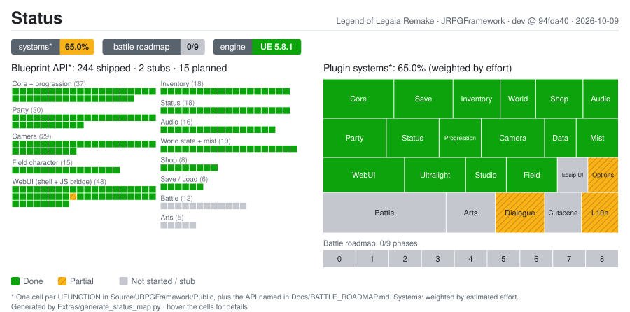

# JRPGFramework

**A modular JRPG systems plugin for Unreal Engine 5.8, built for a _Legend of Legaia_ remake.**


**English** · [Português (BR)](README.pt-BR.md)

JRPGFramework holds the game systems of the Legend of Legaia Remake by LIX Studios: inventory, party,
status, shops, saves, camera, audio and an HTML UI rendered in-engine. It is a standalone plugin. It
defines the structs, subsystems and UI, and references no specific assets. Meshes, textures and sounds
live in the game project.

It is **not a port** of the original game. The [`legend-of-legaia-re`][re] reverse-engineering project
is read as a *specification*. Each system is written from scratch in C++ with the design changes this
remake wants. What comes from the original is **data** (tables validated against the disc), never code.

---

## Contents

- [Current status](#current-status)
- [What's done](#whats-done)
- [What's missing](#whats-missing)
- [Getting started](#getting-started)
- [Repository layout](#repository-layout)
- [Documentation](#documentation)
- [Contributing](#contributing)
- [Credits](#credits)
- [License and disclaimer](#license-and-disclaimer)

---

## Current status

<a href="Docs/STRUCTURE.md"></a>

The map is generated by `python Extras/generate_status_map.py`. The left panel has one cell per
`UFUNCTION` parsed from `Source/JRPGFramework/Public`, plus the API that
[`Docs/BATTLE_ROADMAP.md`](Docs/BATTLE_ROADMAP.md) names but that does not exist yet. The right panel
weights each system by estimated effort. Hover any cell for details.

| Area | State |
|---|---|
| Field systems (core, save, inventory, world state, shop, party, status, audio, camera) | ✅ Done |
| HTML UI (Ultralight shell, field menus, gamepad / keyboard / mouse) | ✅ Done |
| Data pipeline (8 DataTables as CSV + LegaiaStudio editor) | ✅ Done |
| Options screen, Dialogue, Localization | 🟡 Partial |
| Battle and Arts | ⬜ Stubs only, with an approved 9-phase plan |
| Cutscene, Equip screen | ⬜ Not started |

---

## What's done

12 `UGameInstanceSubsystem`s that register themselves once the project's GameInstance inherits
`UJRPGGameInstance`. That is about 15k lines of C++.

| System | Highlights |
|---|---|
| **Core** | Gold with `OnGoldChanged`, tick-free playtime, map and position for saves, New Game, DataTable resolution with fallback |
| **Progression** | XP curve and stat growth taken from the original disc and checked against it, plus Normal / Hard / Juggernaut difficulty ([details](Docs/Reference/PROGRESSION.md)) |
| **Save / Load** | 15 slots, automatic gather and restore, map change + teleport, save versioning |
| **Inventory** | `DT_Items` (225 rows), stacks up to 99, item use routed to the right subsystem |
| **World state** | Event flags, chests, Revival Trees, `bIsInField` (gates the SAVE tab) |
| **Shop** | `DT_Shops` (32 shops), atomic buy/sell, featured items gated by `platinum_card`, flag gating |
| **Party** | Roster vs formation, XP split among survivors as in the original, level-up with jitter |
| **Status** | 5 equipment slots, conditions, Ra-Seru level 1..9, elemental affinity, the original's `effective ( base )` stat |
| **Audio** | BGM that persists across maps with crossfade, 4 volume channels saved to settings |
| **Camera** | 13 framing presets with DOF, 8 procedural shakes, level cameras and zones, shot-reverse-shot conversation, `FrameGroup` / `Orbit` ready for battle |
| **WebUI** | A single-page HTML shell rendered by [Ultralight][ul] on its own thread, through a custom D3D11 GPU driver: menu, items, party, shop, save/load, options, main menu, popups and a dev screen |
| **Tools** | [LegaiaStudio](Extras/LegaiaStudio/README.md), a local web panel that edits the CSVs record by record and runs the builds, plus the WebUI build, plugin packaging and data converters in [`Extras/`](Extras/) |

---

## What's missing

| Item | State | Notes |
|---|---|---|
| **Battle** | ⬜ Stub | 71 lines that log `TODO`. The plan is [`Docs/BATTLE_ROADMAP.md`](Docs/BATTLE_ROADMAP.md): 9 phases (0–8), from disc extraction to magic and Seru |
| **Arts** | ⬜ Stub | Directional Arts and the new AP model (regular Arts *add* AP, Hyper / Super / Miracle *spend* it). Roadmap phase 6 |
| **Dialogue** | 🟡 Partial | The conversation camera and the `OpenDialogue` signature are done. The dialogue runtime, its data format and an editor are missing |
| **Cutscene** | ⬜ Not started | The camera pieces it needs already exist |
| **Localization** | 🟡 Partial | `FText` is used everywhere and the Language option exists. Runtime culture switching and a string pipeline (Unreal and WebUI) are missing |
| **Equip screen** | ⬜ Not started | The Status rules work, but there is no UI for them |
| **Options** | 🟡 Partial | The screen is built. Its values are not wired to `UGameUserSettings` / `UAudioSubsystem` yet |
| **Effective stats in UI** | 🟡 Partial | The party and shop screens still show base stats |
| **License file** | ⬜ Missing | See [License and disclaimer](#license-and-disclaimer) |

### Battle roadmap

| Phase | Scope | Status |
|---|---|---|
| 0 | Extract assets from the disc (Rust + `legaia-extract`) | Not started |
| 1 | Battle data (TOML → CSV → DataTable) | Not started |
| 2 | PS1 3D assets (GLB + skin injection → SkeletalMesh) | Not started |
| 3 | Enemies roaming the map | Not started |
| 4 | Battle stage (spawn, formation, camera) | Not started |
| 5 | Basic combat (turns, damage, death, victory) | Not started |
| 6 | Directional Arts + the new AP | Not started |
| 7 | Presentation (HUD, attack camera, sound, items, escape) | Not started |
| 8 | Magic and Seru | Not started |

---

## Getting started

**Requirements:** Unreal Engine **5.8.1**, Visual Studio with MSVC **14.51+**, Python **3.10+** (stdlib only).

1. Download the free [Ultralight SDK][ul] **1.4.0.1b4b800** and extract it into
   `Content/ThirdParty/Ultralight/`. Its license does not allow it to be redistributed in a source
   repository, so it is not included.
2. Generate the UI: `python Extras/build_webui.py`
3. Package the plugin: `python Extras/build_plugin.py`. Check the two paths at the top of the script.
4. In your UE 5.8 project, make the GameInstance inherit `UJRPGGameInstance`, import the CSVs from
   `Docs/Data/` as DataTables under `/Game/Data/`, and call `WebUISubsystem → InitializeUIShell` on
   the map's `BeginPlay`.

Read [**SETUP.md**](SETUP.md) for the full walkthrough. It also covers the build failure that trips most
people up: a missing `shaders/hlsl/bin/`.

---

## Repository layout

```
JRPGFramework/
├── Source/JRPGFramework/   C++ runtime module (Public/ + Private/, one folder per system)
├── Content/UI/             WebUI sources (src/ → generated shell.html), fonts, images, UI sounds
├── Docs/                   Architecture, structure, roadmap, guides, reference, data (CSV)
│   └── status/             Status map shown above
├── Extras/                 Dev tools: LegaiaStudio, build scripts, data converters
├── Config/                 Plugin config
├── SETUP.md                Build from a clean clone
└── CONTRIBUTING.md         How changes get in
```

---

## Documentation

| Document | What it is |
|---|---|
| [`Docs/README.md`](Docs/README.md) | Documentation index |
| [`Docs/ARCHITECTURE.md`](Docs/ARCHITECTURE.md) | How the plugin fits together, and the 47 rules that must not be broken |
| [`Docs/STRUCTURE.md`](Docs/STRUCTURE.md) | File-by-file tree: what exists, what is a stub, what is planned |
| [`Docs/BATTLE_ROADMAP.md`](Docs/BATTLE_ROADMAP.md) | The battle system, in 9 phases |
| [`Docs/Guides/`](Docs/Guides/) | How to use each system (save, inventory, shop, party, status, audio, camera, WebUI…) |
| [`Docs/Reference/`](Docs/Reference/) | Progression formulas and the Ultralight integration |

---

## Contributing

Fork the repository and open pull requests against **`dev`**. `main` only receives tested batches from
`dev`. Read [**CONTRIBUTING.md**](CONTRIBUTING.md) first. It covers the conventions, the data workflow
(the CSV is the source of truth) and where battle work should start.

---

## Credits

This project stands on other people's work.

- **[legend-of-legaia-re][re]** by [andrewaltimit](https://github.com/andrewaltimit) (MIT / Unlicense).
  This reverse-engineering project of the original game, written in Rust, is the specification this
  remake reads from. The XP curve, stat growth, item, shop and character tables, and the whole battle
  design in the roadmap come from its research and documentation. **Thank you.**
- **[DuckStation](https://github.com/stenzek/duckstation)** by stenzek. The character and enemy meshes
  used in the game project are extracted with its 3D dump. They are not part of this repository.
- **[Ultralight][ul]** by Ultralight, Inc. is the HTML renderer behind the whole UI. It is used under
  the Ultralight Free License, and its `NOTICES.md` must appear in the credits of any shipped build.
- ***Legend of Legaia*** (1998) was developed by Contrail and Prokion and published by Sony Computer
  Entertainment. It is the game this remake is a love letter to.

**LIX Studios:** [itch.io](https://lixstudios.itch.io/legend-of-legaia-remake) ·
[YouTube](https://www.youtube.com/@LixStudiosGames) ·
[Patreon](https://www.patreon.com/cw/LegendofLegaiaRemake)

---

## License and disclaimer

This repository does not include a license file yet. Until one is added, default copyright applies, so
ask before reusing the code outside of contributions to this project.

This is a fan project. It is not affiliated with, endorsed by or sponsored by Sony Interactive
Entertainment or the original developers. *Legend of Legaia* and its characters belong to their
respective owners. Anything extracted from the original disc stays on the developer's machine and is
never committed to this repository.

[re]: https://github.com/andrewaltimit/legend-of-legaia-re
[ul]: https://ultralig.ht
