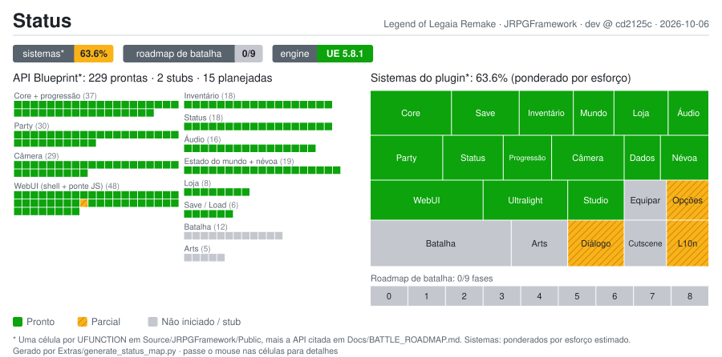

# JRPGFramework

**Plugin modular de sistemas JRPG para Unreal Engine 5.8, feito para um remake de _Legend of Legaia_.**


[English](README.md) · **Português (BR)**

O JRPGFramework reúne os sistemas de jogo do Legend of Legaia Remake da LIX Studios: inventário, party,
status, lojas, saves, câmera, áudio e uma UI em HTML renderizada dentro da engine. É um plugin
independente. Ele define as structs, os subsistemas e a UI, e não referencia nenhum asset específico.
Meshes, texturas e sons ficam no projeto do jogo.

**Não é um port** do jogo original. O projeto de engenharia reversa [`legend-of-legaia-re`][re] é lido
como *especificação*. Cada sistema é escrito do zero em C++, com as mudanças de design que este remake
quer. Do original vêm **dados** (tabelas validadas contra o disco), nunca código.

> A documentação técnica em `Docs/` está em inglês. Comentários e logs do código estão em português.

---

## Sumário

- [Status atual](#status-atual)
- [O que já foi feito](#o-que-já-foi-feito)
- [O que falta](#o-que-falta)
- [Como começar](#como-começar)
- [Estrutura do repositório](#estrutura-do-repositório)
- [Documentação](#documentação)
- [Como contribuir](#como-contribuir)
- [Créditos](#créditos)
- [Licença e aviso legal](#licença-e-aviso-legal)

---

## Status atual

<a href="Docs/STRUCTURE.md"></a>

O mapa é gerado por `python Extras/generate_status_map.py`. O painel da esquerda tem uma célula por
`UFUNCTION` lida de `Source/JRPGFramework/Public`, mais a API que o
[`Docs/BATTLE_ROADMAP.md`](Docs/BATTLE_ROADMAP.md) cita mas que ainda não existe. O painel da direita
pondera cada sistema pelo esforço estimado. Passe o mouse em qualquer célula para ver os detalhes.

| Área | Estado |
|---|---|
| Sistemas de campo (core, save, inventário, estado do mundo, loja, party, status, áudio, câmera) | ✅ Pronto |
| UI em HTML (shell Ultralight, menus de campo, gamepad / teclado / mouse) | ✅ Pronto |
| Pipeline de dados (8 DataTables em CSV + editor LegaiaStudio) | ✅ Pronto |
| Tela de opções, Diálogo, Localização | 🟡 Parcial |
| Batalha e Arts | ⬜ Só stubs, com um plano aprovado de 9 fases |
| Cutscene, tela de equipamento | ⬜ Não iniciado |

---

## O que já foi feito

São 12 `UGameInstanceSubsystem`s que se registram sozinhos quando a GameInstance do projeto herda de
`UJRPGGameInstance`. Ao todo, cerca de 15 mil linhas de C++.

| Sistema | Destaques |
|---|---|
| **Core** | Gold com `OnGoldChanged`, tempo de jogo sem tick, mapa e posição para o save, New Game, resolução de DataTable com fallback |
| **Progressão** | Curva de XP e crescimento de stats tirados do disco original e conferidos contra ele, mais as dificuldades Normal / Hard / Juggernaut ([detalhes](Docs/Reference/PROGRESSION.md)) |
| **Save / Load** | 15 slots, coleta e restauração automáticas, troca de mapa + teleporte, versionamento de save |
| **Inventário** | `DT_Items` (225 linhas), pilhas de até 99, uso de item roteado para o subsistema certo |
| **Estado do mundo** | Flags de evento, baús, Revival Trees, `bIsInField` (bloqueia a aba SAVE) |
| **Loja** | `DT_Shops` (32 lojas), compra/venda atômica, itens em destaque liberados pelo `platinum_card`, liberação por flag |
| **Party** | Roster vs formação, XP dividido entre os sobreviventes como no original, level-up com variação |
| **Status** | 5 slots de equipamento, condições, nível de Ra-Seru 1..9, afinidade elemental, o stat `efetivo ( base )` do original |
| **Áudio** | BGM que persiste entre mapas com crossfade, 4 canais de volume salvos nas configurações |
| **Câmera** | 13 presets de enquadramento com DOF, 8 tremores procedurais, câmeras de nível e zonas, plano e contraplano para conversas, `FrameGroup` / `Orbit` prontos para a batalha |
| **WebUI** | Shell HTML de página única renderizado pelo [Ultralight][ul] em thread própria, com um driver de GPU D3D11 próprio: menu, itens, party, loja, save/load, opções, menu principal, popups e tela de dev |
| **Ferramentas** | [LegaiaStudio](Extras/LegaiaStudio/README.md), um painel web local que edita os CSVs registro por registro e roda os builds, mais o build da WebUI, o empacotamento do plugin e os conversores de dados em [`Extras/`](Extras/) |

---

## O que falta

| Item | Estado | Observações |
|---|---|---|
| **Batalha** | ⬜ Stub | 71 linhas que registram `TODO`. O plano está no [`Docs/BATTLE_ROADMAP.md`](Docs/BATTLE_ROADMAP.md): 9 fases (0–8), da extração do disco até magia e Seru |
| **Arts** | ⬜ Stub | Arts direcionais e o novo modelo de AP (Arts normais *somam* AP, Hyper / Super / Miracle *gastam*). Fase 6 do roadmap |
| **Diálogo** | 🟡 Parcial | A câmera de conversa e a assinatura de `OpenDialogue` estão prontas. Faltam o runtime de diálogo, o formato de dados e um editor |
| **Cutscene** | ⬜ Não iniciado | As peças de câmera necessárias já existem |
| **Localização** | 🟡 Parcial | `FText` em todo lugar e a opção de idioma já existe. Faltam a troca de cultura em runtime e um pipeline de strings (Unreal e WebUI) |
| **Tela de equipamento** | ⬜ Não iniciado | As regras do Status funcionam, mas não há UI para elas |
| **Opções** | 🟡 Parcial | A tela está pronta. Os valores ainda não estão ligados a `UGameUserSettings` / `UAudioSubsystem` |
| **Stats efetivos na UI** | 🟡 Parcial | As telas de party e loja ainda mostram os stats base |
| **Arquivo de licença** | ⬜ Falta | Veja [Licença e aviso legal](#licença-e-aviso-legal) |

### Roadmap de batalha

| Fase | Escopo | Status |
|---|---|---|
| 0 | Extrair assets do disco (Rust + `legaia-extract`) | Não iniciada |
| 1 | Dados de batalha (TOML → CSV → DataTable) | Não iniciada |
| 2 | Assets 3D do PS1 (GLB + injeção de skin → SkeletalMesh) | Não iniciada |
| 3 | Inimigos andando pelo mapa | Não iniciada |
| 4 | Palco da batalha (spawn, formação, câmera) | Não iniciada |
| 5 | Combate básico (turnos, dano, morte, vitória) | Não iniciada |
| 6 | Arts direcionais + o novo AP | Não iniciada |
| 7 | Apresentação (HUD, câmera de ataque, som, itens, fuga) | Não iniciada |
| 8 | Magia e Seru | Não iniciada |

---

## Como começar

**Requisitos:** Unreal Engine **5.8.1**, Visual Studio com MSVC **14.51+**, Python **3.10+** (só a
biblioteca padrão).

1. Baixe o [Ultralight SDK][ul] **1.4.0.1b4b800**, que é gratuito, e extraia em
   `Content/ThirdParty/Ultralight/`. A licença dele não permite redistribuir em repositório de código,
   por isso ele não vem incluso.
2. Gere a UI: `python Extras/build_webui.py`
3. Empacote o plugin: `python Extras/build_plugin.py`. Confira os dois caminhos no topo do script.
4. No seu projeto UE 5.8, faça a GameInstance herdar de `UJRPGGameInstance`, importe os CSVs de
   `Docs/Data/` como DataTables em `/Game/Data/` e chame `WebUISubsystem → InitializeUIShell` no
   `BeginPlay` do mapa.

O passo a passo completo está no [**SETUP.md**](SETUP.md) (em inglês). Ele também explica a falha de
build que mais pega gente: a pasta `shaders/hlsl/bin/` faltando.

---

## Estrutura do repositório

```
JRPGFramework/
├── Source/JRPGFramework/   Módulo runtime em C++ (Public/ + Private/, uma pasta por sistema)
├── Content/UI/             Fontes da WebUI (src/ → shell.html gerado), fontes, imagens, sons de UI
├── Docs/                   Arquitetura, estrutura, roadmap, guias, referência, dados (CSV)
│   └── status/             Mapa de status mostrado acima
├── Extras/                 Ferramentas: LegaiaStudio, scripts de build, conversores de dados
├── Config/                 Configuração do plugin
├── SETUP.md                Build a partir de um clone limpo
└── CONTRIBUTING.md         Como as mudanças entram
```

---

## Documentação

| Documento | O que é |
|---|---|
| [`Docs/README.md`](Docs/README.md) | Índice da documentação |
| [`Docs/ARCHITECTURE.md`](Docs/ARCHITECTURE.md) | Como o plugin se encaixa, e as 47 regras que não podem ser quebradas |
| [`Docs/STRUCTURE.md`](Docs/STRUCTURE.md) | Árvore arquivo por arquivo: o que existe, o que é stub, o que está planejado |
| [`Docs/BATTLE_ROADMAP.md`](Docs/BATTLE_ROADMAP.md) | O sistema de batalha, em 9 fases |
| [`Docs/Guides/`](Docs/Guides/) | Como usar cada sistema (save, inventário, loja, party, status, áudio, câmera, WebUI…) |
| [`Docs/Reference/`](Docs/Reference/) | Fórmulas de progressão e a integração com o Ultralight |

---

## Como contribuir

Faça um fork e abra pull requests contra a **`dev`**. A `main` só recebe lotes já testados vindos da
`dev`. Leia antes o [**CONTRIBUTING.md**](CONTRIBUTING.md). Ele explica as convenções, o fluxo de dados
(o CSV é a fonte da verdade) e por onde começar o trabalho de batalha.

---

## Créditos

Este projeto se apoia no trabalho de outras pessoas.

- **[legend-of-legaia-re][re]**, de [andrewaltimit](https://github.com/andrewaltimit) (MIT / Unlicense).
  Este projeto de engenharia reversa do jogo original, escrito em Rust, é a especificação que este
  remake usa. A curva de XP, o crescimento de stats, as tabelas de itens, lojas e personagens e todo o
  design de batalha do roadmap vêm da pesquisa e da documentação dele. **Obrigado.**
- **[DuckStation](https://github.com/stenzek/duckstation)**, de stenzek. As meshes de personagens e
  inimigos usadas no projeto do jogo são extraídas com o dump 3D dele. Elas não fazem parte deste
  repositório.
- **[Ultralight][ul]**, da Ultralight, Inc., é o renderizador HTML por trás de toda a UI. É usado sob a
  Ultralight Free License, e o `NOTICES.md` dele precisa aparecer nos créditos de qualquer build
  publicado.
- ***Legend of Legaia*** (1998) foi desenvolvido pela Contrail e pela Prokion e publicado pela Sony
  Computer Entertainment. É o jogo a quem este remake presta homenagem.

**LIX Studios:** [itch.io](https://lixstudios.itch.io/legend-of-legaia-remake) ·
[YouTube](https://www.youtube.com/@LixStudiosGames) ·
[Patreon](https://www.patreon.com/cw/LegendofLegaiaRemake)

---

## Licença e aviso legal

Este repositório ainda não tem um arquivo de licença. Até que um seja adicionado, vale o direito
autoral padrão. Peça autorização antes de reutilizar o código fora de contribuições para este projeto.

Este é um projeto de fã. Não tem vínculo com, nem é endossado ou patrocinado pela Sony Interactive
Entertainment ou pelos desenvolvedores originais. *Legend of Legaia* e seus personagens pertencem aos
seus respectivos donos. Tudo o que é extraído do disco original fica na máquina de quem desenvolve e
nunca entra neste repositório.

[re]: https://github.com/andrewaltimit/legend-of-legaia-re
[ul]: https://ultralig.ht
